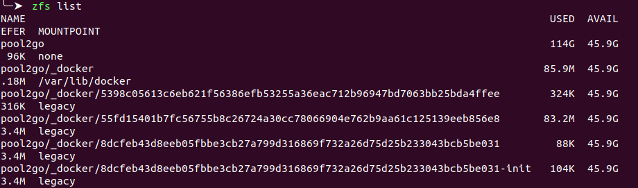
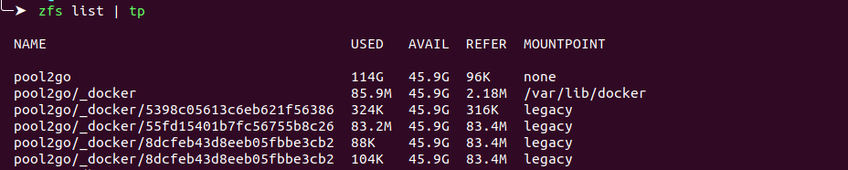
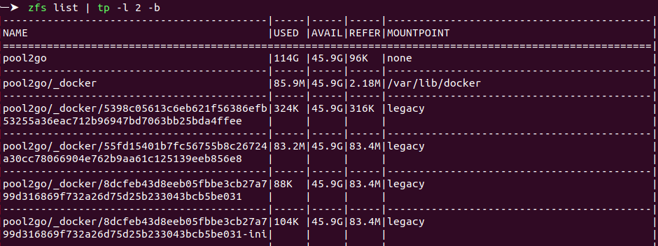

tp
===

A simple terminal prettifyer to fix broken tables!

Description
===========

Example:
    zfs list will break if a row is greater than terminal width.
    You can fix it with zfs list | tp. Works with zfs, docker and any cli that outputs a table.

Note
====

This project has been set up using PyScaffold 3.2.3. For details and usage
information on PyScaffold see https://pyscaffold.org/.
