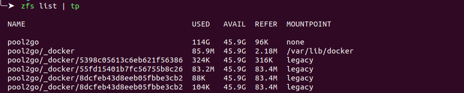
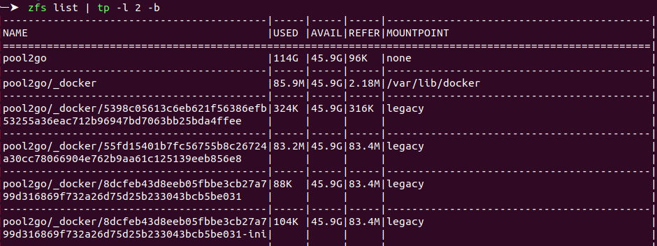

tp
===

A simple terminal script to fix broken tables! Can fix broken table outputs of tools like `docker`, `kubectl` and `zfs`.

# Installation

```shell
$ pip install git+https://github.com/Mardoqueu-Pimentel/tp.git
```

# Usage
```shell
$ tp --help
```

# Example





